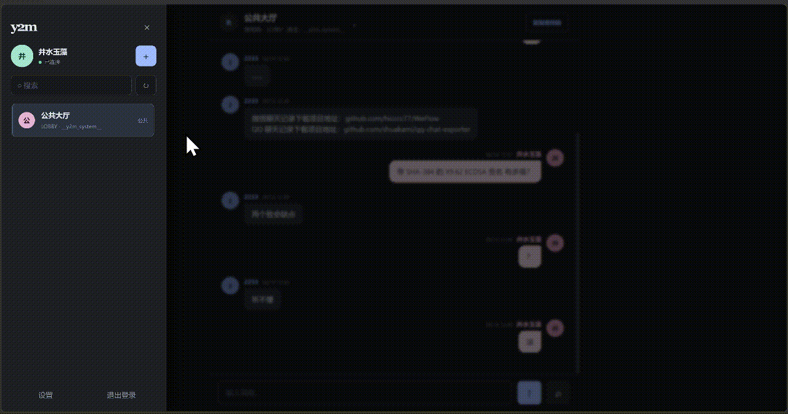

<div align="center">

# Y2M

**一个 Rust + SQLite 实现的在线文字聊天室 Demo，编译为单文件可执行程序。**

[](https://www.rust-lang.org)
[](https://www.sqlite.org)
[](https://developer.mozilla.org/docs/Web/API/WebSocket)
[](LICENSE)

简约安静的网页界面 · 私密 · 实时推送 · 零外部服务



</div>

---

## 简介

Y2M 是一个私密文字聊天应用。服务端用 Rust 编写，数据存于本地 SQLite，前端界面（`index.html` / `app.js` / `style.css`）在编译时通过 `include_str!` 嵌入可执行文件，最终产物是一个无外部依赖的单文件程序，开箱即用。

## 特性

- **单文件部署**：编译后仅一个可执行文件，前端资源内嵌。
- **本地存储**：所有数据保存在 SQLite，无需额外数据库服务。
- **账号体系**：支持用户名 / 密码登录，管理员可切换开放注册或邀请码注册。
- **房间管理**：自动创建不可删除的「公共大厅」；普通房间由创建者管理，仅房主可删除。
- **实时消息**：基于 WebSocket 推送，断线自动重连并补齐离线消息。
- **记录检索**：聊天记录分页加载，支持关键词搜索、按日期筛选、时间顺序切换。
- **数据备份**：管理员可一键下载数据库快照，或上传备份文件恢复（服务自动重启）。
- **安全加固**：Argon2 密码哈希、登录计时防护、注册限流、安全响应头。

## 快速开始

需要 [Rust 1.97+](https://www.rust-lang.org/tools/install)：

```powershell
cargo run
```

启动后打开 <http://localhost:8000> 即可使用。

发布版本：

```powershell
cargo build --release
.\target\release\y2m.exe
```

## 构建

| 脚本 | 说明 | 产物 |
| --- | --- | --- |
| `build_debug.bat` | 调试构建 | `target\debug\y2m.exe` |
| `build_release.bat` | 发布构建 | `target\release\y2m.exe` |
| `build_linux.bat` | 静态 Linux 构建（需 [Zig](https://ziglang.org/download/) + `cargo-zigbuild`） | `target\x86_64-unknown-linux-musl\release\y2m` |
| `build_docker.py` | 打包 Docker 镜像（纯 Python，无需 Docker） | `y2m-<version>.tar` |

## 启动参数

命令行参数优先于环境变量，未设置时使用默认值：

```powershell
.\target\release\y2m.exe -p 8000 -db .\server.sqlite3 -ms 0 -rm 0 -cook yes
```

| 参数 | 默认值 | 说明 |
| --- | --- | --- |
| `-p` | `8000` | 监听端口，范围 1-65535 |
| `-db` | `y2m.sqlite3` | SQLite 数据库文件路径 |
| `-ms` | `0` | 消息保留秒数，`0` 表示永不按时间删除 |
| `-rm` | `0` | 每个房间的消息数量上限，`0` 表示不限制 |
| `-cook` | `no` | 是否启用 Secure Cookie，可用 `yes` / `no` |
| `-debug` | 未启用 | 启用详细日志 |

示例：

```powershell
.\target\release\y2m.exe -p 9000 -db .\data\chat.sqlite3 -ms 86400 -rm 10000 -cook yes -debug
```

## 环境变量

命令行未覆盖时使用环境变量：

| 变量 | 默认值 | 说明 |
| --- | --- | --- |
| `PORT` | `8000` | 监听端口 |
| `Y2M_DB` | `y2m.sqlite3` | SQLite 数据库文件路径 |
| `Y2M_MESSAGE_RETENTION_SECS` | `0` | 消息保留秒数，`0` 表示永不按时间删除 |
| `Y2M_MAX_MESSAGES_PER_ROOM` | `0` | 每个房间的消息数量上限，`0` 表示不限制 |
| `Y2M_SECURE_COOKIE` | 未设置 | 设为 `yes` / `1` 时启用 Secure Cookie，`no` / `0` 关闭 |

## 管理员

服务器首次启动且数据库中没有管理员时，会创建默认管理员，并在终端输出一次随机生成的初始密码：

```text
用户名：井水玉藻
密码：<随机生成的 24 位密码>
```

请登录后立即修改密码。管理员可在「设置」中选择开放注册或仅限邀请码注册，并设置邀请码。

为减少批量注册滥用，同一来源 IP 每小时最多尝试注册 10 次。登录接口按用户名（每分钟 5 次）和来源 IP（每分钟 30 次）双重限流，登录成功后重置计数。服务直接使用 TCP 对端 IP，不信任转发请求头；部署在反向代理后时，限流按代理来源统计。

### 数据备份与恢复

管理员在「设置 → 数据库」页签可管理数据：

- **下载备份**：通过 SQLite 在线备份 API 导出一致快照，浏览器下载 `.sqlite3` 文件。
- **恢复备份**：上传备份文件（校验 SQLite 完整性与表结构），服务写入待恢复文件后自动重启并应用；恢复会清空当前内存会话，所有用户需重新登录。

备份/恢复接口仅管理员可用：`GET /api/admin/backup`、`POST /api/admin/backup/restore`。

## 功能说明

- 服务首次启动时自动创建不可删除的「公共大厅」，所有用户都可以加入。普通房间由创建者管理，只有房主可以删除。
- 聊天记录按页加载，每次最多 50 条，滚动到边缘继续加载更早记录。聊天区支持关键词搜索、按日期筛选和时间顺序切换。

### 实时消息

新消息使用 WebSocket 实时推送，不再依赖定时轮询：

- 客户端访问 `/api/ws`，通过现有的 `y2m_session` Cookie 完成鉴权。
- 进入聊天室后发送房间订阅，服务端仅推送当前订阅房间的消息。
- 消息写入 SQLite 成功后立即通过单实例内存广播发送，客户端逐条追加并按消息 ID 去重。
- WebSocket 断线重连时携带最后消息 ID，并通过 `/api/messages?room=<id>&after=<id>` 补齐离线期间的消息。
- 广播使用容量为 1024 的有界队列；慢客户端发生溢出时触发 REST 重新同步。

## 部署

- 使用反向代理部署时，需要将 `/api/ws` 配置为支持 WebSocket Upgrade。
- 当前广播为单实例内存实现；多实例部署需要将广播层替换为 Redis Pub/Sub。
- 默认数据库文件为当前目录的 `y2m.sqlite3`，可通过 `-db` 或 `Y2M_DB` 指定路径。

### Docker

无需 Docker 也能生成镜像归档（纯 Python，直接产出 `docker save` 格式的 tar）：

```powershell
# 先构建静态 Linux 二进制（或已存在 target\x86_64-unknown-linux-musl\release\y2m）
.\build_linux.bat
python build_docker.py
```

执行 `build_docker.py` 时会询问版本号；脚本会将版本号写入镜像标签，并使用当前 UTC 时间作为镜像创建时间。

在装有 Docker 的机器上：

```powershell
docker load -i y2m-0.1.1.tar
docker run -d --name y2m -p 8000:8000 y2m:0.1.1
```

Docker 环境变量可通过 `-e` 或 `--env-file` 传入。数据库应挂载到宿主机目录，避免删除容器时丢失数据：

```powershell
docker run -d `
  --name y2m `
  -p 8000:8000 `
  -v D:\y2m-data:/data `
  -e PORT=8000 `
  -e Y2M_DB=/data/y2m.sqlite3 `
  -e Y2M_SECURE_COOKIE=1 `
  -e Y2M_MESSAGE_RETENTION_SECS=0 `
  -e Y2M_MAX_MESSAGES_PER_ROOM=0 `
  y2m:0.1.1
```

也可以创建 `.env` 文件：

```env
PORT=8000
Y2M_DB=/data/y2m.sqlite3
Y2M_SECURE_COOKIE=1
Y2M_MESSAGE_RETENTION_SECS=0
Y2M_MAX_MESSAGES_PER_ROOM=0
```

然后使用环境变量文件启动：

```powershell
docker run -d `
  --name y2m `
  --env-file .env `
  -p 8000:8000 `
  -v D:\y2m-data:/data `
  y2m:0.1.1
```

命令行参数优先于环境变量。使用 `scratch` 镜像时，容器内的数据库目录必须是已挂载且可写的目录。

`build_docker.py` 默认读取 `target\x86_64-unknown-linux-musl\release\y2m`，以 `scratch` 为基座生成极小的单层镜像；输入版本号 `0.1.1` 时默认生成 `y2m-0.1.1.tar`，镜像标签为 `y2m:0.1.1`。可用 `--binary`、`--tag`、`--port`、`-o` 覆盖默认值。

## 技术栈

| 领域 | 选型 |
| --- | --- |
| Web 框架 | [axum](https://github.com/tokio-rs/axum) |
| 异步运行时 | [tokio](https://tokio.rs) |
| 数据库 | [rusqlite](https://github.com/rusqlite/rusqlite)（bundled SQLite） |
| 密码哈希 | [argon2](https://crates.io/crates/argon2) |
| 序列化 | [serde](https://serde.rs) / [serde_json](https://github.com/serde-rs/json) |
| 实时通信 | WebSocket（axum `ws` feature） |

## 目录结构

```text
y2m/
├── src/
│   ├── main.rs       # 服务端逻辑（路由、鉴权、房间、消息、WebSocket）
│   ├── index.html    # 页面结构
│   ├── app.js        # 前端交互
│   └── style.css     # 界面样式
├── Cargo.toml
├── build_*.bat       # 构建脚本
└── build_docker.py   # Docker 镜像打包脚本
```

## 安全审计

```powershell
cargo install cargo-audit
cargo audit
```

## License

[MIT](LICENSE) © 2026 Raven777777
